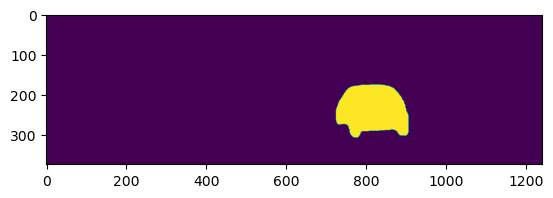

# March 6th

Input format of trackrcnn seems like

````
0 723.8499755859375 173.62062072753906 185.27008056640625 134.31040954589844 0.9960479140281677 1 375 1242 YSZ8k0h:8J4K5L3K5M2M3M300N2O1N2O1N2O0O2N2O1N2N2O1O1N2O2M2O101M3N2N1O5L3M2L9I3L3N3M0O2O2N0O2O1O00001O0O100000000000O100O001N200M3O0M4O1O1O100000000000000000000000000000000O1000O100000000000000000000000000000000000000000000000O10001O0000000000000000001N10001O0000000000001O00001O0O2O001O00001O1O00100O1O1O10001OO01011M10010OO200N002O0O1O3M2N1O2N1O2N5K1O2N7I2N6I3N1N4K4L5KWRj3
````

 column | meanings
--------|----------
0 | frame number
1 | 

# March 7th

Study rle to mask convert method. Forturnately, inputs from trackrcnn is matched with kitti.

```py
import pycocotools.mask
from matplotlib import pyplot as plt
rle = {'size': [375, 1242], 'counts':  "YSZ8k0h:8J4K5L3K5M2M3M300N2O1N2O1N2O0O2N2O1N2N2O1O1N2O2M2O101M3N2N1O5L3M2L9I3L3N3M0O2O2N0O2O1O00001O0O100000000000O100O001N200M3O0M4O1O1O100000000000000000000000000000000O1000O100000000000000000000000000000000000000000000000O10001O0000000000000000001N10001O0000000000001O00001O0O2O001O00001O1O00100O1O1O10001OO01011M10010OO200N002O0O1O3M2N1O2N1O2N5K1O2N7I2N6I3N1N4K4L5KWRj3"}
after = pycocotools.mask.decode(rle)
plt.imshow(after)
plt.show()
```



In trackcnn results, many are with low scores, so can be neglected.