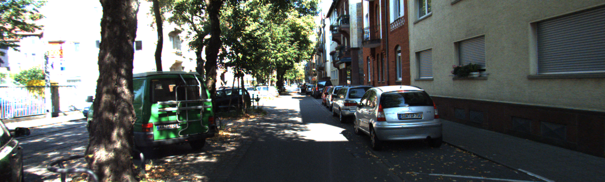
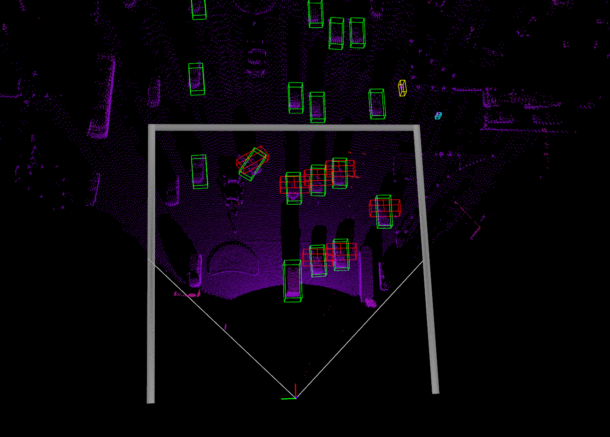

# March 24th

Hi! I am reproducing EagerMOT on KITTI with pointgnn as 3d detection and tracking_best(motsfusion + trackrcnn) as 2d detection for my bachelor degree thesis. But I am quite confusing about the format of the detection results of trackrcnn. In website of MOTS, under downloads there are 3 subtitles. I don't know which dataset should I use and their format. Could you please help me understand their format? Or can you give the source of format they use?

I download the files from Detection for Tracking Oly Challenge, and unzip MOTS20_detections.zip. There is a folder named KITTI_MOTS in it. And I use this as input, but I can not understand the input format. The txt format mentioned in https://www.vision.rwth-aachen.de/page/mots consisted of 6 parts for each line. But in each line in the txt I downloaded there are more than 10 items as follows:

```
0 723.8499755859375 173.62062072753906 185.27008056640625 134.31040954589844 0.9960479140281677 1 375 1242 YSZ8k0h:8J4K5L3K5M2M3M300N2O1N2O1N2O0O2N2O1N2N2O1O1N2O2M2O101M3N2N1O5L3M2L9I3L3N3M0O2O2N0O2O1O00001O0O100000000000O100O001N200M3O0M4O1O1O100000000000000000000000000000000O1000O100000000000000000000000000000000000000000000000O10001O0000000000000000001N10001O0000000000001O00001O0O2O001O00001O1O00100O1O1O10001OO01011M10010OO200N002O0O1O3M2N1O2N1O2N5K1O2N7I2N6I3N1N4K4L5KWRj3
```

I tried to compare the format with your code in input/detections_ed.py parse_trackrcnn_seg() function as follows.

```
def parse_trackrcnn_seg(seg_values):
    """ Returns class, score, mask, bbox and reid parsed from input """
    mask = {'size': [int(seg_values[7]), int(seg_values[8])],
            'counts': seg_values[9].strip().encode(encoding='UTF-8')}
    box = (int(float(seg_values[1])), int(float(seg_values[2])),
           int(float(seg_values[3])), int(float(seg_values[4])))
    return (int(seg_values[6]), float(seg_values[5]), mask, box, [float(e) for e in seg_values[10:]])
```

 I guess some idems in file mean classes, scores, masks, boxes and reids. In MOTS website, the annotation mentioned  run-length encoding but in this function, the rle(10th item, very long string) is assigned to mask['counts']. I don't understand what does this variable mean. Website say rle is related to [cocotool](https://github.com/cocodataset/cocoapi). But I didn't find anything related to this mask['counts'] value and cocotool in the repo.

The txt downloaded from under MOTSChallenge seems like

```
0 1109.5554 179.36575 1197.3547 314.45007 0.9999083 2 375 1242 Ygf<5b;0000O2O1N_;0`D5L2N1N2N2cFFZ7=eHFT7?kHDP7?oHCn6`0PIAn6c0nH_On6g0nH[On6l0lHWOP7o0kHUOR7n0kHTOS7P1iHROR7V1hHmNo6b1eHdN[7l20O10000N2M3H8K5N2O1N2N2M3N2O1O1001O001O0015K2O2N1N1O1O001O4eNUGAU9MWG1Z:N0O0O101O1N3N000001N2O1N2N2O4LO1O2N2N2N1O001O2N2N2N2N000000kU`0 -0.3751167 0.48021537 0.032476578 -0.28660417 -0.70799315 -0.52072155 0.08180365 -0.013868877 0.036078844 -0.23432338 0.10030153 0.2857126 -0.53020716 0.12753601 0.40149367 0.7348276 0.043223802 -0.13538602 -0.14182042 -0.6249713 0.30748948 0.26873767 0.025597623 0.31074926 0.32362318 0.08508656 0.3480975 0.020496124 -0.1315603 -0.060836367 -0.39438733 -0.60612524 -0.15734667 0.08845482 0.075994976 0.21069686 0.06765656 -0.3943655 -0.050879166 0.26497495 -0.56978315 -0.5910222 0.0981341 -0.5647276 0.5951754 -0.10315818 -0.23011783 -0.8937163 0.36296442 0.23472416 0.2052533 0.17285214 -0.08307746 -0.26530197 -0.43209535 -0.13557851 0.25855196 -0.4168136 -0.2923897 0.2938376 0.7098037 0.39629406 -0.033923443 -0.17291501 -0.38073516 -0.07897187 0.37062654 -0.12985493 0.1492367 -0.45166814 -0.64741623 -0.5740453 -0.23283233 -0.14643145 -0.27898163 0.014514893 -0.1434794 -0.6008462 -0.09011394 -0.41281822 0.2717996 -0.96931094 -0.24767381 0.14481777 -0.23039247 -0.46699083 -0.07223604 0.04203764 0.26910537 0.24745579 -0.57074845 -0.078286625 -0.53346604 -0.29033712 -0.09410042 -0.27020353 -0.22399586 0.561881 -0.6308956 -0.006530372 -0.13324912 -0.33152327 -0.31110197 -0.2549216 -0.2163514 -0.34898254 0.21159562 0.29987532 -0.40363675 0.24261205 -0.33671173 0.81703144 0.46958938 -0.69749266 0.1615237 -0.50936264 -0.16553718 -0.1437751 -0.03610575 -0.030241877 0.27487156 0.75182754 -0.17875957 -0.520232 -0.029418062 0.15701526 0.051346615 -0.11979125
```
what is the number after rle( run-length encoding) mean? Do they mean reid?

I am new to object tracking field so the question above is probably basic. I will appreciate it if you give some kind help.

# March 6th

Input format of trackrcnn seems like

````
0 723.8499755859375 173.62062072753906 185.27008056640625 134.31040954589844 0.9960479140281677 1 375 1242 YSZ8k0h:8J4K5L3K5M2M3M300N2O1N2O1N2O0O2N2O1N2N2O1O1N2O2M2O101M3N2N1O5L3M2L9I3L3N3M0O2O2N0O2O1O00001O0O100000000000O100O001N200M3O0M4O1O1O100000000000000000000000000000000O1000O100000000000000000000000000000000000000000000000O10001O0000000000000000001N10001O0000000000001O00001O0O2O001O00001O1O00100O1O1O10001OO01011M10010OO200N002O0O1O3M2N1O2N1O2N5K1O2N7I2N6I3N1N4K4L5KWRj3
````

 column | meanings
--------|----------
0 | frame number
1 | 

# March 7th

Study rle to mask convert method. Forturnately, inputs from trackrcnn is matched with kitti.

```py
import pycocotools.mask
from matplotlib import pyplot as plt
rle = {'size': [375, 1242], 'counts':  "YSZ8k0h:8J4K5L3K5M2M3M300N2O1N2O1N2O0O2N2O1N2N2O1O1N2O2M2O101M3N2N1O5L3M2L9I3L3N3M0O2O2N0O2O1O00001O0O100000000000O100O001N200M3O0M4O1O1O100000000000000000000000000000000O1000O100000000000000000000000000000000000000000000000O10001O0000000000000000001N10001O0000000000001O00001O0O2O001O00001O1O00100O1O1O10001OO01011M10010OO200N002O0O1O3M2N1O2N1O2N5K1O2N7I2N6I3N1N4K4L5KWRj3"}
after = pycocotools.mask.decode(rle)
plt.imshow(after)
plt.show()
```



In trackcnn results, many are with low scores, so can be neglected.

# March 9th

Download Dair-V2X-I dataset. In image photo, 007084 become red from blue.

The image set is aligned with velodyne set. [Explanation](https://blog.csdn.net/zhouqiping/article/details/123171905)

**Question** how can multiple sensors achieve time syncronization.

# March 13th

run TrackEval on KITTI val set by HOTA metrics. The results are 

HOTA: 
EagerMOT-car| HOTA|  DetA|  AssA|  DetRe| DetPr| AssRe| AssPr| LocA|  OWTA|  HOTA(0)|   LocA(0)|   HOTALocA(0)
-|-|-|-|-|-|-|-|-|-|-|-|-|
0002|   53.711|49.066|59.081|50.789|86.084|61.606|88.639|86.87| 54.742|62.617|84.816|53.109
0006|   80.969|84.762|77.656|88.168|89.059|79.912|91.349|89.029|82.7|  91.423|88.005|80.457
0007|   83.244|81.566|85.05| 90.391|83.947|91.531|87.421|89.512|87.659|93.909|88.557|83.163
0008|   76.27| 81.024|71.936|84.769|85.533|74.265|87.491|86.095|78.085|90.494|84.318|76.303
0010|   81.261|78.375|84.384|83.929|87.868|86.242|92.934|90.362|84.15| 90.376|89.21| 80.624
0013|   39.585|17.872|87.752|89.895|17.979|89.895|89.895|88.796|88.75| 44.721|87.917|39.318
0014|   77.485|75.13| 80.428|81.38| 83.41| 85.91| 87.112|86.506|80.851|91.818|83.966|77.095
0016|   81.565|84.502|79.052|87.761|88.077|80.403|91.35| 88.292|83.268|91.996|87.407|80.411
0018|   86.987|85.657|88.485|90.081|88.63| 91.454|91.406|89.474|89.258|97.958|88.445|86.639
COMBINED|   78.529|76.839|80.506|82.917|85.081|84.239|89.777|88.541|81.683|89.395|87.245|77.993

different from 74.39 HOTA, 75.27 DetA, 74.16 AssA in paper, which is evaluated on KITTI test set. But the ground truth is not open sourced.

## MOT metrics

**Several concept**

$$
\text{Accuracy}=\frac{TP+TN}{TP+TN+FP+FN}\\
\text{Precision}=\frac{TP}{TP+FP}\\
\text{Recall}=\frac{TP}{TP+FN}
$$

**Classical metrics**
- MT: Mostly Tracked Trajectories (frames tracked successfully $\ge$ 80%)
- Fragments: (frames tracked successfully $\le$ 80%)
- ML: Mostly Lost Trajectories (frames tracked successfully $\le$ 20%)

**Clear MOT metrics**
- FP: false positve number
- FN: false negative number
- Fragm(FM): fragmentation number
- IDSW: ID switch
- MOTA: 
$$ MOTA=1-\frac{\Sigma_t(FN_t+FP_t+IDSW_t)}{\Sigma_tGT_t} $$

We run the trackeval on Clear metrics

CLEAR: 
EagerMOT-car MOTA      MOTP      MODA      CLR_Re    CLR_Pr    MTR       PTR       MLR       sMOTA     CLR_TP    CLR_FN    CLR_FP    IDSW      MT        PT        ML        Frag
0002                56.8      84.898    58        58.5      99.153    60        20        20        47.965    585       415       5         12        9         3         3         22
0006                96.8      88.005    97        98        98.99     100       0         0         85.045    490       10        5         1         11        0         0         3
0007                91.713    88.606    91.713    99.695    92.587    100       0         0         80.354    1961      6         157       0         53        0         0         2
0008                96.726    84.389    97.52     98.313    99.199    95.238    4.7619    0         81.378    991       17        8         8         20        1         0         7
0010                87.931    89.21     88.276    91.897    96.209    69.231    30.769    0         78.015    533       47        21        2         9         4         0         3
0013                -300      87.917    -300      100       20        100       0         0         -312.08   25        0         100       0         1         0         0         0
0014                86.861    85.12     86.861    92.214    94.514    92.857    7.1429    0         73.14     379       32        22        0         13        1         0         7
0016                96.651    87.407    96.77     98.206    98.559    100       0         0         84.284    821       15        12        1         4         0         0         10
0018                97.136    88.508    97.218    99.427    97.826    94.444    5.5556    0         85.71     1215      7         27        1         17        1         0         3
COMBINED            87.667    87.354    87.998    92.728    95.147    91.333    6.6667    2         75.941    7000      549       357       25        137       10        3         57
# March 15th

5 tables in EagerMOT

- table I NuScenes 3D MOT benchmark
- table II 3D MOT evaluation on val set KITTI (metrics by AB3DMOT)
- table III 2D MOT KITTI benchmark test set
- table IV NuScenes 3D MOT benchmark val set, data assosiation ablation
- table V 2D MOT KITTI val set, detection ablation

clone polarmot to visualize the work.

In reporting file
```python
def write_to_mot_file(frame_name: str, predicted_instances: Iterable[FusedInstance],
                      mot_3d_file: IO,
                      mot_2d_from_3d_only_file: Optional[IO]) -> None:
    mot_3d_results_str, mot_2d_results_str = "", ""
    tracking_3d_format = "%d %d %s 0 0 %f -1 -1 -1 -1 %f %f %f %f %f %f %f %f\n"
    tracking_2d_format = "%d %d %s 0 0 -10 %f %f %f %f -1 -1 -1 -1000 -1000 -1000 -10 %f\n"

    for instance in predicted_instances:
        if not instance.report_mot:
            continue

        assert instance.class_id is not None
        track_type = detections_2d.SEG_TO_TRACK_CLASS[instance.class_id]

        bbox3d_coords = instance.coordinates_3d
        if bbox3d_coords is not None:
            bbox3d = instance.bbox3d

            res_3d = (tracking_3d_format % (int(frame_name), instance.track_id, track_type, bbox3d.obs_angle,
                                            bbox3d_coords[0], bbox3d_coords[1], bbox3d_coords[2],
                                            bbox3d_coords[3], bbox3d_coords[4], bbox3d_coords[5], bbox3d_coords[6], bbox3d.confidence))
            mot_3d_results_str += res_3d

        if mot_2d_from_3d_only_file is not None:
            bbox2d = instance.projected_bbox_3d
            if bbox2d is not None:
                res_2d = (tracking_2d_format % (int(frame_name), instance.track_id, track_type,
                                                bbox2d[0], bbox2d[1], bbox2d[2], bbox2d[3], instance.bbox3d.confidence))
                mot_2d_results_str += res_2d

    mot_3d_file.write(mot_3d_results_str)
    if mot_2d_from_3d_only_file is not None:
        mot_2d_from_3d_only_file.write(mot_2d_results_str)
```

We can see that, the format of results is
- 3 frame, track_id, track_type
- 2 truncated occluded (set as 0) % why 0?
- 1 alpha (only 3d, -10 in 2d)
- 4 2d coords (-1 in 3d)
- 3 3d dimentions hwl (-1 in 2d)
- 3 3d coords (-1000 in 2d)
- 1 rotaion (only 3d, -10 in 2d)
- 1 confidence

18 values in total.

# March 15th

Clone MOTSFusion. Dataset from Baidu is without mask, which is only for detection task instead of segmentation task.

After comparing, I found mask and reids are totally not used in EagerMOT. I don't understand why author write them into the code, for completeness?

This means that I can use other detection and get box only, and set mask and reids as NONE.

MOTSFusion:

- detection and segmentation from 38
- stronger detector from 29 segmentation from 21
- previous SOTA 33
- detection from 38 segmentation from 21 reported
- cars only for 29
- using 21 instead of 38, 29 instead of 38 improve sMOTSA
  
- 38 MOTS: Trackrcnn, which is extended from MaskRCNN
- 29 RRC, recurrent rolling convolution
- 21 

We plan to use FasterRCNN or yolo to train 2d network.

April 15th

When reproduce PointRCNN

pyyaml yaml.load() should add `loader = Loader` inside.

In lib/datasets/kitti_rcnn_dataset.py line 298

code resample the points so that the number is npoints set in cfg. But if choosing replace = False, there are not enough point to sample. So modify to replace = True

April 17th

epochs:   0%|                                                         | 0/70 [08:58<?, ?it/s, reg_fg_sum=31, loss=2.36, lr=0.000202]
epochs: 100%|██████████████████████████████████████████████| 70/70 [19:36:58<00:00, 1008.83s/it, reg_fg_sum=14, loss=0.592, lr=2e-8]

April 20th

bbox AP:96.9126, 89.5387, 88.7488
bev  AP:90.2156, 87.8947, 85.5191
3d   AP:89.1939, 78.8542, 77.9137
aos  AP:96.90, 89.42, 88.54
Car AP@0.70, 0.50, 0.50:
bbox AP:96.9126, 89.5387, 88.7488
bev  AP:97.0941, 89.8168, 89.3443
3d   AP:97.0544, 89.7747, 89.2549
aos  AP:96.90, 89.42, 88.54

April 28th

environment for visualization

The visualization sometimes not working, producing a blank window by ```cv2.imshow```

Two strange bugs

```
QObject::moveToThread: Current thread (0x120ad90) is not the object's thread (0x17ba3e0).
Cannot move to target thread (0x120ad90)

qt.qpa.plugin: Could not load the Qt platform plugin "xcb" in "/home/ackerman/Public/miniconda3/envs/Vis/lib/python3.7/site-packages/cv2/qt/plugins" even though it was found.
This application failed to start because no Qt platform plugin could be initialized. Reinstalling the application may fix this problem.

Available platform plugins are: xcb, eglfs, linuxfb, minimal, minimalegl, offscreen, vnc, wayland-egl, wayland, wayland-xcomposite-egl, wayland-xcomposite-glx, webgl.
```

The first one comes from qt lib conflict of pyqt in conda and opencv in pip.

The second one comes from qt lib conflict of opencv and pyqt5.

The solution is to install both opencv and mayavi in conda or pip.

But in conda opencv and mayavi will make conflicts.

So just install opencv mayavi vtk pyqt5 in pip. Everything goes fine.

May 4th

捏妈妈的，大无语事件。调了一周bug，越来越感觉是数据集label的问题，可视化结果出来车都是向下歪的。

首先，他娘的这个相机是朝地上拍的，和雷达之间有个夹角，和kitti不一样，所以计算bounding box的时候不可以先在rect里面算长方体再投影到velo里。要先把orientation向量投到velo再算3dbox。还好我空间感强，看着旋转矩阵就感觉不对。

这个旋转矩阵居然不是正交的，太逆天了，线性代数都没学好了属于是。

其次，这个标注文件真的太无语了，kitti是按照hwl的顺序标注的，但是它生成的文件居然是hlw的

如图所示

红色是预测框，很奇怪，都是横过来的，原因就是宽度w和长度l反了。奶奶滴。

在查源码的时候还发现一个问题，kitti的yaw角度是按照rect坐标系x轴顺时针为正的，和数学里逆时针还不一样。

十分钟之后发现是因为y轴朝下的缘故

我又发现dair的yaw角度是按照相对z轴的旋转角度来的，这也解释了为什么一开始可视化看不出来，本来w和l反过来就相当于少转了90度，z轴比x轴超前90度，又弥补回去了，就看不出问题，负负得正了。

继续查dair源码，里面有个转换函数是这样的

```
def write_kitti_in_txt(my_json, path_txt):
    wf = open(path_txt, "w")
    for item in my_json:
        i1 = str(item["type"]).title()
        i2 = str(item["truncated_state"])
        i3 = str(item["occluded_state"])
        i4 = str(item["alpha"])
        i5, i6, i7, i8 = (
            str(item["2d_box"]["xmin"]),
            str(item["2d_box"]["ymin"]),
            str(item["2d_box"]["xmax"]),
            str(item["2d_box"]["ymax"]),
        )
        # i9, i10, i11 = str(item["3d_dimensions"]["h"]), str(item["3d_dimensions"]["w"]), str(item["3d_dimensions"]["l"])
        i9, i11, i10 = str(item["3d_dimensions"]["h"]), str(item["3d_dimensions"]["w"]), str(item["3d_dimensions"]["l"])
        i12, i13, i14 = str(item["3d_location"]["x"]), str(item["3d_location"]["y"]), str(item["3d_location"]["z"])
        # i15 = str(item["rotation"])
        i15 = str(-eval(item["rotation"]))
        item_list = [i1, i2, i3, i4, i5, i6, i7, i8, i9, i10, i11, i12, i13, i14, i15]
        item_string = " ".join(item_list) + "\n"
        wf.write(item_string)
    wf.close()
```

i10和i11被莫名其妙的调换了位置，看不懂啥意思。